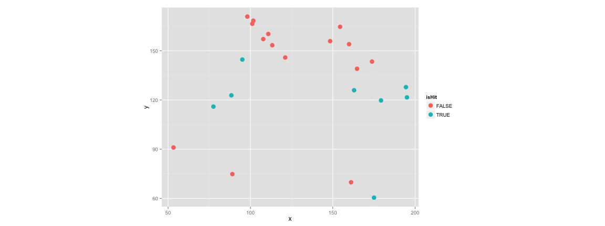

## 工欲善其事，必先利其器


```r
# install.packages("Lahman")
library(Lahman)
library(dplyr)
totalRS <- Teams %>% select(yearID, R, G) %>% mutate(AvgRperG = R/G) %>% group_by(yearID) %>% summarise(sum(AvgRperG))
names(totalRS) <- c("yearID", "RUN")
head(totalRS)
```

```
## Source: local data frame [6 x 2]
## 
##   yearID      RUN
## 1   1871 93.12897
## 2   1872 95.21474
## 3   1873 73.15998
## 4   1874 58.55903
## 5   1875 70.08774
## 6   1876 47.01267
```

---

## 工欲善其事，必先利其器


```r
library(ggplot2)
ggplot(data = totalRS, aes(x = yearID, y = RUN)) + stat_smooth() + geom_line()
```

```
## geom_smooth: method="auto" and size of largest group is <1000, so using loess. Use 'method = x' to change the smoothing method.
```

 

---

## 工欲善其事，必先利其器


```r
library(Lahman)
library(dplyr)
head(filter(Pitching, playerID == "wangch01"))
```

```
##   playerID yearID stint teamID lgID  W L  G GS CG SHO SV IPouts   H ER HR
## 1 wangch01   2005     1    NYA   AL  8 5 18 17  0   0  0    349 113 52  9
## 2 wangch01   2006     1    NYA   AL 19 6 34 33  2   1  1    654 233 88 12
## 3 wangch01   2007     1    NYA   AL 19 7 30 30  1   0  0    598 199 82  9
## 4 wangch01   2008     1    NYA   AL  8 2 15 15  1   0  0    285  90 43  4
## 5 wangch01   2009     1    NYA   AL  1 6 12  9  0   0  0    126  66 45  7
## 6 wangch01   2011     1    WAS   NL  4 3 11 11  0   0  0    187  67 28  8
##   BB  SO BAOpp  ERA IBB WP HBP BK BFP GF  R SH SF GIDP
## 1 32  47    NA 4.02   3  3   6  0 486  0 58 NA NA   NA
## 2 52  76    NA 3.63   4  6   2  1 900  1 92 NA NA   NA
## 3 59 104    NA 3.70   1  9   8  1 823  0 84 NA NA   NA
## 4 35  54    NA 4.07   1  0   3  0 402  0 44 NA NA   NA
## 5 19  29    NA 9.64   1  3   2  0 206  2 46 NA NA   NA
## 6 13  25    NA 4.04   0  2   1  0 264  0 35 NA NA   NA
```

---

## 工欲善其事，必先利其器


```r
# install.packages("Sxslt", repos = "http://www.omegahat.org/R", type = "source")
# require(devtools)
# install_github("openWAR", "beanumber")
require(openWAR)
getGameIds(date=as.Date("2015-08-20"))
```

```
## 
## Retrieving data from 2015-08-20 ...
## ...found 11 games
```

```
##  [1] "gid_2015_08_20_arimlb_cinmlb_1" "gid_2015_08_20_atlmlb_chnmlb_1"
##  [3] "gid_2015_08_20_chamlb_anamlb_1" "gid_2015_08_20_clemlb_nyamlb_1"
##  [5] "gid_2015_08_20_kcamlb_bosmlb_1" "gid_2015_08_20_minmlb_balmlb_1"
##  [7] "gid_2015_08_20_phimlb_miamlb_1" "gid_2015_08_20_sfnmlb_pitmlb_1"
##  [9] "gid_2015_08_20_tbamlb_houmlb_1" "gid_2015_08_20_texmlb_detmlb_1"
## [11] "gid_2015_08_20_wasmlb_colmlb_1"
```

---

## 工欲善其事，必先利其器


```r
gd = gameday(gameId="gid_2015_08_20_wasmlb_colmlb_1")
```

```
## gid_2015_08_20_wasmlb_colmlb_1
```

```r
gd$url
```

```
##                                                                                                        bis_boxscore.xml 
##      "http://gd2.mlb.com/components/game/mlb/year_2015/month_08/day_20/gid_2015_08_20_wasmlb_colmlb_1/bis_boxscore.xml" 
##                                                                                                          inning_all.xml 
## "http://gd2.mlb.com/components/game/mlb/year_2015/month_08/day_20/gid_2015_08_20_wasmlb_colmlb_1/inning/inning_all.xml" 
##                                                                                                          inning_hit.xml 
## "http://gd2.mlb.com/components/game/mlb/year_2015/month_08/day_20/gid_2015_08_20_wasmlb_colmlb_1/inning/inning_hit.xml" 
##                                                                                                                game.xml 
##              "http://gd2.mlb.com/components/game/mlb/year_2015/month_08/day_20/gid_2015_08_20_wasmlb_colmlb_1/game.xml" 
##                                                                                                         game_events.xml 
##       "http://gd2.mlb.com/components/game/mlb/year_2015/month_08/day_20/gid_2015_08_20_wasmlb_colmlb_1/game_events.xml"
```

---

## 工欲善其事，必先利其器


```r
str(gd$ds)
```

```
## Classes 'GameDayPlays', 'tbl_df', 'tbl' and 'data.frame':	66 obs. of  62 variables:
##  $ pitcherId     : num  453286 453286 453286 453286 456071 ...
##  $ batterId      : num  453568 408314 471865 571448 150029 ...
##  $ field_teamId  : chr  "120" "120" "120" "120" ...
##  $ ab_num        : num  5 6 7 8 1 2 3 4 12 13 ...
##  $ inning        : num  1 1 1 1 1 1 1 1 2 2 ...
##  $ half          : Factor w/ 2 levels "bottom","top": 1 1 1 1 2 2 2 2 1 1 ...
##  $ balls         : num  3 1 4 1 0 1 0 2 0 2 ...
##  $ strikes       : num  2 0 1 0 3 2 1 1 0 1 ...
##  $ endOuts       : num  1 2 2 3 1 2 2 3 1 2 ...
##  $ event         : Factor w/ 18 levels "Defensive Sub",..: 3 3 18 3 17 7 2 7 3 7 ...
##  $ actionId      : num  NA NA NA NA NA NA NA NA NA NA ...
##  $ description   : Factor w/ 73 levels "Anthony Rendon flies out to right fielder Carlos Gonzalez.  ",..: 16 37 15 53 35 2 9 73 5 42 ...
##  $ stand         : Factor w/ 2 levels "L","R": 1 1 1 2 2 2 1 2 1 2 ...
##  $ throws        : Factor w/ 2 levels "L","R": 2 2 2 2 1 1 1 1 2 2 ...
##  $ runnerMovement: chr  "" "" "[471865::1B::Walk]" "[471865:1B:::Flyout]" ...
##  $ x             : num  119.4 77.2 NA 142.8 NA ...
##  $ y             : num  76.7 105.2 NA 61 NA ...
##  $ game_type     : Factor w/ 1 level "R": 1 1 1 1 1 1 1 1 1 1 ...
##  $ home_team     : Factor w/ 1 level "col": 1 1 1 1 1 1 1 1 1 1 ...
##  $ home_teamId   : num  115 115 115 115 115 115 115 115 115 115 ...
##  $ home_lg       : Factor w/ 1 level "NL": 1 1 1 1 1 1 1 1 1 1 ...
##  $ away_team     : Factor w/ 1 level "was": 1 1 1 1 1 1 1 1 1 1 ...
##  $ away_teamId   : num  120 120 120 120 120 120 120 120 120 120 ...
##  $ away_lg       : Factor w/ 1 level "NL": 1 1 1 1 1 1 1 1 1 1 ...
##  $ venueId       : num  19 19 19 19 19 19 19 19 19 19 ...
##  $ stadium       : Factor w/ 1 level "Coors Field": 1 1 1 1 1 1 1 1 1 1 ...
##  $ timestamp     : chr  "2015-08-21 00:47:05" "2015-08-21 00:49:55" "2015-08-21 00:51:05" "2015-08-21 00:52:49" ...
##  $ playerId.C    : num  467092 467092 467092 467092 572863 ...
##  $ playerId.1B   : num  475582 475582 475582 475582 572019 ...
##  $ playerId.2B   : num  543685 543685 543685 543685 518614 ...
##  $ playerId.3B   : num  488862 488862 488862 488862 571448 ...
##  $ playerId.SS   : num  435622 435622 435622 435622 408314 ...
##  $ playerId.LF   : num  150029 150029 150029 150029 473724 ...
##  $ playerId.CF   : num  572191 572191 572191 572191 453568 ...
##  $ playerId.RF   : num  547180 547180 547180 547180 471865 ...
##  $ batterPos     : chr  "CF" "SS" "RF" "3B" ...
##  $ batterName    : Factor w/ 26 levels "Arenado","Axford",..: 4 18 10 1 25 17 11 7 15 12 ...
##  $ pitcherName   : Factor w/ 26 levels "Arenado","Axford",..: 21 21 21 21 8 8 8 8 21 21 ...
##  $ runsOnPlay    : int  0 0 0 0 0 0 0 0 0 0 ...
##  $ startOuts     : num  0 1 2 2 0 1 2 2 0 1 ...
##  $ runsInInning  : int  0 0 0 0 0 0 0 0 0 0 ...
##  $ runsITD       : num  0 0 0 0 0 0 0 0 0 0 ...
##  $ runsFuture    : num  0 0 0 0 0 0 0 0 0 0 ...
##  $ start1B       : chr  NA NA NA "471865" ...
##  $ start2B       : chr  NA NA NA NA ...
##  $ start3B       : chr  NA NA NA NA ...
##  $ end1B         : chr  NA NA "471865" NA ...
##  $ end2B         : chr  NA NA NA NA ...
##  $ end3B         : chr  NA NA NA NA ...
##  $ outsInInning  : num  3 3 3 3 3 3 3 3 3 3 ...
##  $ startCode     : num  0 0 0 1 0 0 0 2 0 0 ...
##  $ endCode       : num  0 0 1 0 0 0 2 0 0 0 ...
##  $ fielderId     : num  572191 150029 NA 572191 NA ...
##  $ gameId        : chr  "gid_2015_08_20_wasmlb_colmlb_1" "gid_2015_08_20_wasmlb_colmlb_1" "gid_2015_08_20_wasmlb_colmlb_1" "gid_2015_08_20_wasmlb_colmlb_1" ...
##  $ isPA          : logi  TRUE TRUE TRUE TRUE TRUE TRUE ...
##  $ isAB          : logi  TRUE TRUE FALSE TRUE TRUE TRUE ...
##  $ isHit         : logi  FALSE FALSE FALSE FALSE FALSE FALSE ...
##  $ isBIP         : logi  TRUE TRUE FALSE TRUE FALSE TRUE ...
##  $ our.x         : num  -13.9 -119.2 NA 44.4 NA ...
##  $ our.y         : num  305 234 NA 344 NA ...
##  $ r             : num  305 263 NA 347 NA ...
##  $ theta         : num  1.62 2.04 NA 1.44 NA ...
```

---

## 工欲善其事，必先利其器


```r
ggplot(data = gd$ds, aes(x = x, y = y, color = isHit)) + geom_point(size = 3) + coord_fixed()
```

```
## Warning: Removed 22 rows containing missing values (geom_point).
```

 

---

## Recap

### 拿資料

- 靜態資料庫
  - [Lahman Database](http://lahman.r-forge.r-project.org/)

- 即時資料源
  - [pitchRx](http://cpsievert.github.io/pitchRx/#2D_animation)
  - [openWAR](https://baseballwithr.wordpress.com/2014/03/17/introduction-to-openwar/)

- 隨時爬網頁
  - [RSelenium](http://ropensci.github.io/RSelenium/)
  - [phantomJS](http://phantomjs.org/)

---

## Recap

### 玩資料

- 賽博計量學
  - [pitchRx](http://cpsievert.github.io/pitchRx/#2D_animation)
  - [openWAR](https://baseballwithr.wordpress.com/2014/03/17/introduction-to-openwar/)
  
- 資料視覺化
  - [ggplot2](http://ggplot2.org/)
  - [recharts](http://yihui.name/recharts/)
  - [dygraphs](http://rstudio.github.io/dygraphs/)

---

## 意猶未盡嗎？更多精彩的內容等著大家⋯⋯


