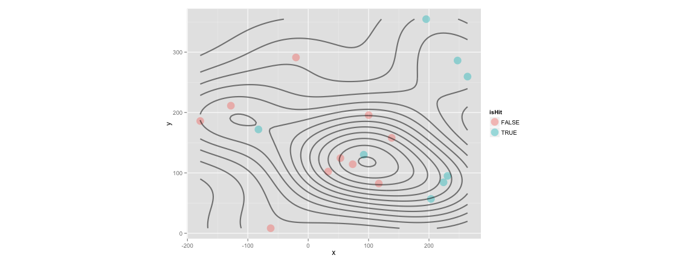

## 工欲善其事，必先利其器


```r
# install.packages("Lahman")
library(Lahman)
library(dplyr)
totalRS <- Teams %>% select(yearID, R, G) %>% mutate(AvgRperG = R/G) %>% group_by(yearID) %>% summarise(sum(AvgRperG))
names(totalRS) <- c("yearID", "RUN")
head(totalRS)
```

```
## Source: local data frame [6 x 2]
## 
##   yearID      RUN
## 1   1871 93.12897
## 2   1872 95.21474
## 3   1873 73.15998
## 4   1874 58.55903
## 5   1875 70.08774
## 6   1876 47.01267
```

---

## 工欲善其事，必先利其器


```r
library(ggplot2)
ggplot(data = totalRS, aes(x = yearID, y = RUN)) + stat_smooth() + geom_line()
```

```
## geom_smooth: method="auto" and size of largest group is <1000, so using loess. Use 'method = x' to change the smoothing method.
```

 

---

## 工欲善其事，必先利其器


```r
library(Lahman)
library(dplyr)
head(filter(Pitching, playerID == "wangch01"))
```

```
##   playerID yearID stint teamID lgID  W L  G GS CG SHO SV IPouts   H ER HR
## 1 wangch01   2005     1    NYA   AL  8 5 18 17  0   0  0    349 113 52  9
## 2 wangch01   2006     1    NYA   AL 19 6 34 33  2   1  1    654 233 88 12
## 3 wangch01   2007     1    NYA   AL 19 7 30 30  1   0  0    598 199 82  9
## 4 wangch01   2008     1    NYA   AL  8 2 15 15  1   0  0    285  90 43  4
## 5 wangch01   2009     1    NYA   AL  1 6 12  9  0   0  0    126  66 45  7
## 6 wangch01   2011     1    WAS   NL  4 3 11 11  0   0  0    187  67 28  8
##   BB  SO BAOpp  ERA IBB WP HBP BK BFP GF  R SH SF GIDP
## 1 32  47    NA 4.02   3  3   6  0 486  0 58 NA NA   NA
## 2 52  76    NA 3.63   4  6   2  1 900  1 92 NA NA   NA
## 3 59 104    NA 3.70   1  9   8  1 823  0 84 NA NA   NA
## 4 35  54    NA 4.07   1  0   3  0 402  0 44 NA NA   NA
## 5 19  29    NA 9.64   1  3   2  0 206  2 46 NA NA   NA
## 6 13  25    NA 4.04   0  2   1  0 264  0 35 NA NA   NA
```

---

## 工欲善其事，必先利其器


```r
# install.packages("Sxslt", repos = "http://www.omegahat.org/R", type = "source")
# require(devtools)
# install_github("openWAR", "beanumber")
require(openWAR)
getGameIds(date=as.Date("2015-08-22"))
```

```
## 
## Retrieving data from 2015-08-22 ...
## ...found 15 games
```

```
##  [1] "gid_2015_08_22_arimlb_cinmlb_1" "gid_2015_08_22_atlmlb_chnmlb_1"
##  [3] "gid_2015_08_22_chamlb_seamlb_1" "gid_2015_08_22_clemlb_nyamlb_1"
##  [5] "gid_2015_08_22_kcamlb_bosmlb_1" "gid_2015_08_22_lanmlb_houmlb_1"
##  [7] "gid_2015_08_22_milmlb_wasmlb_1" "gid_2015_08_22_minmlb_balmlb_1"
##  [9] "gid_2015_08_22_nynmlb_colmlb_1" "gid_2015_08_22_phimlb_miamlb_1"
## [11] "gid_2015_08_22_sfnmlb_pitmlb_1" "gid_2015_08_22_slnmlb_sdnmlb_1"
## [13] "gid_2015_08_22_tbamlb_oakmlb_1" "gid_2015_08_22_texmlb_detmlb_1"
## [15] "gid_2015_08_22_tormlb_anamlb_1"
```

---

## 工欲善其事，必先利其器


```r
gd = gameday(gameId="gid_2015_08_22_clemlb_nyamlb_1")
```

```
## gid_2015_08_22_clemlb_nyamlb_1
```

```r
gd$url
```

```
##                                                                                                        bis_boxscore.xml 
##      "http://gd2.mlb.com/components/game/mlb/year_2015/month_08/day_22/gid_2015_08_22_clemlb_nyamlb_1/bis_boxscore.xml" 
##                                                                                                          inning_all.xml 
## "http://gd2.mlb.com/components/game/mlb/year_2015/month_08/day_22/gid_2015_08_22_clemlb_nyamlb_1/inning/inning_all.xml" 
##                                                                                                          inning_hit.xml 
## "http://gd2.mlb.com/components/game/mlb/year_2015/month_08/day_22/gid_2015_08_22_clemlb_nyamlb_1/inning/inning_hit.xml" 
##                                                                                                                game.xml 
##              "http://gd2.mlb.com/components/game/mlb/year_2015/month_08/day_22/gid_2015_08_22_clemlb_nyamlb_1/game.xml" 
##                                                                                                         game_events.xml 
##       "http://gd2.mlb.com/components/game/mlb/year_2015/month_08/day_22/gid_2015_08_22_clemlb_nyamlb_1/game_events.xml"
```

---

## 工欲善其事，必先利其器


```r
# now playing
gd$ds$inning
```

```
##  [1] 1 1 1 1 1 1 1 1 1 1 1 1
```

```r
gd$ds$description
```

```
##  [1] Jacoby Ellsbury singles on a soft line drive to left fielder Mike Aviles.                
##  [2] Brett Gardner homers (12) on a line drive to right field.    Jacoby Ellsbury scores.     
##  [3] Carlos Beltran grounds out, shortstop Francisco Lindor to first baseman Carlos Santana.  
##  [4] Brian McCann homers (22) on a fly ball to right center field.                            
##  [5] Greg Bird flies out to center fielder Abraham Almonte.                                   
##  [6] Chase Headley singles on a soft line drive to left fielder Mike Aviles.                  
##  [7] Didi Gregorius flies out to left fielder Mike Aviles.                                    
##  [8] Jason Kipnis flies out to left fielder Brett Gardner.                                    
##  [9] Francisco Lindor homers (6) on a line drive to right field.                              
## [10] Michael Brantley flies out to left fielder Brett Gardner.                                
## [11] Carlos Santana walks.                                                                    
## [12] Lonnie Chisenhall pops out to third baseman Chase Headley in foul territory.             
## 13 Levels: Brett Gardner homers (12) on a line drive to right field.    Jacoby Ellsbury scores.   ...
```

---

## 工欲善其事，必先利其器


```r
str(gd$ds)
```

```
## Classes 'GameDayPlays', 'tbl_df', 'tbl' and 'data.frame':	12 obs. of  62 variables:
##  $ pitcherId     : num  517593 517593 517593 517593 517593 ...
##  $ batterId      : num  453056 458731 136860 435263 595885 ...
##  $ field_teamId  : chr  "114" "114" "114" "114" ...
##  $ ab_num        : num  6 7 8 9 10 11 12 1 2 3 ...
##  $ inning        : num  1 1 1 1 1 1 1 1 1 1 ...
##  $ half          : Factor w/ 2 levels "bottom","top": 1 1 1 1 1 1 1 2 2 2 ...
##  $ balls         : num  1 1 2 0 3 3 0 1 0 1 ...
##  $ strikes       : num  2 1 2 1 2 2 2 2 2 1 ...
##  $ endOuts       : num  0 0 1 1 2 2 3 1 1 2 ...
##  $ event         : Factor w/ 7 levels "Flyout","Game Advisory",..: 6 4 3 4 1 6 1 1 4 1 ...
##  $ actionId      : num  NA NA NA NA NA NA NA NA NA NA ...
##  $ description   : Factor w/ 13 levels "Brett Gardner homers (12) on a line drive to right field.    Jacoby Ellsbury scores.  ",..: 10 1 3 2 9 5 7 11 8 13 ...
##  $ stand         : Factor w/ 1 level "L": 1 1 1 1 1 1 1 1 1 1 ...
##  $ throws        : Factor w/ 1 level "R": 1 1 1 1 1 1 1 1 1 1 ...
##  $ runnerMovement: chr  "[453056::1B::Single]" "[453056:1B::T:Pickoff Attempt 1B][458731:::T:Pickoff Attempt 1B]" "" "[435263:::T:Home Run]" ...
##  $ x             : num  92 231 138 203 117 ...
##  $ y             : num  130.1 95 158.1 56.9 82.3 ...
##  $ game_type     : Factor w/ 1 level "R": 1 1 1 1 1 1 1 1 1 1 ...
##  $ home_team     : Factor w/ 1 level "nya": 1 1 1 1 1 1 1 1 1 1 ...
##  $ home_teamId   : num  147 147 147 147 147 147 147 147 147 147 ...
##  $ home_lg       : Factor w/ 1 level "AL": 1 1 1 1 1 1 1 1 1 1 ...
##  $ away_team     : Factor w/ 1 level "cle": 1 1 1 1 1 1 1 1 1 1 ...
##  $ away_teamId   : num  114 114 114 114 114 114 114 114 114 114 ...
##  $ away_lg       : Factor w/ 1 level "AL": 1 1 1 1 1 1 1 1 1 1 ...
##  $ venueId       : num  3313 3313 3313 3313 3313 ...
##  $ stadium       : Factor w/ 1 level "Yankee Stadium": 1 1 1 1 1 1 1 1 1 1 ...
##  $ timestamp     : chr  "2015-08-22 17:20:54" "2015-08-22 17:22:45" "2015-08-22 17:25:02" "2015-08-22 17:27:19" ...
##  $ playerId.C    : num  547379 547379 547379 547379 547379 ...
##  $ playerId.1B   : num  467793 467793 467793 467793 467793 ...
##  $ playerId.2B   : num  543401 543401 543401 543401 543401 ...
##  $ playerId.3B   : num  608070 608070 608070 608070 608070 ...
##  $ playerId.SS   : num  596019 596019 596019 596019 596019 ...
##  $ playerId.LF   : num  449107 449107 449107 449107 449107 ...
##  $ playerId.CF   : num  501659 501659 501659 501659 501659 ...
##  $ playerId.RF   : num  502082 502082 502082 502082 502082 ...
##  $ batterPos     : chr  "CF" "LF" "RF" "DH" ...
##  $ batterName    : Factor w/ 20 levels "Almonte","Aviles",..: 8 9 3 14 4 11 10 12 13 5 ...
##  $ pitcherName   : Factor w/ 20 levels "Almonte","Aviles",..: 18 18 18 18 18 18 18 20 20 20 ...
##  $ runsOnPlay    : int  0 2 0 1 0 0 0 0 1 0 ...
##  $ startOuts     : num  0 0 0 1 1 2 2 0 1 1 ...
##  $ runsInInning  : int  3 3 3 3 3 3 3 1 1 1 ...
##  $ runsITD       : num  0 0 2 2 3 3 3 0 0 1 ...
##  $ runsFuture    : num  3 3 1 1 0 0 0 1 1 0 ...
##  $ start1B       : chr  NA "453056" NA NA ...
##  $ start2B       : chr  NA NA NA NA ...
##  $ start3B       : chr  NA NA NA NA ...
##  $ end1B         : chr  "453056" NA NA NA ...
##  $ end2B         : chr  NA NA NA NA ...
##  $ end3B         : chr  NA NA NA NA ...
##  $ outsInInning  : num  3 3 3 3 3 3 3 3 3 3 ...
##  $ startCode     : num  0 1 0 0 0 0 1 0 0 0 ...
##  $ endCode       : num  1 0 0 0 0 1 0 0 0 0 ...
##  $ fielderId     : num  NA NA 596019 NA 501659 ...
##  $ gameId        : chr  "gid_2015_08_22_clemlb_nyamlb_1" "gid_2015_08_22_clemlb_nyamlb_1" "gid_2015_08_22_clemlb_nyamlb_1" "gid_2015_08_22_clemlb_nyamlb_1" ...
##  $ isPA          : logi  TRUE TRUE TRUE TRUE TRUE TRUE ...
##  $ isAB          : logi  TRUE TRUE TRUE TRUE TRUE TRUE ...
##  $ isHit         : logi  TRUE TRUE FALSE TRUE FALSE TRUE ...
##  $ isBIP         : logi  TRUE FALSE TRUE FALSE TRUE TRUE ...
##  $ our.x         : num  -82.4 263.8 33 195.4 -20.3 ...
##  $ our.y         : num  172 259 102 355 291 ...
##  $ r             : num  191 370 107 405 292 ...
##  $ theta         : num  2.018 0.777 1.258 1.067 1.64 ...
```

---

## 工欲善其事，必先利其器


```r
hit <- data.frame(x = cbind(c(gd$ds$x, gd$ds$our.x)), y = cbind(c(gd$ds$y, gd$ds$our.y)), isHit = gd$ds$isHit)
# img <- jpeg::readJPEG("assets/img/670px-Set-up-a-Baseball-Diamond-Step-1.jpg")
# g <- rasterGrob(img, interpolate=TRUE)
ggplot(data = hit, aes(x = x, y = y, color = isHit)) + coord_fixed() + 
#   annotation_custom(g, xmin=-Inf, xmax=Inf, ymin=-Inf, ymax=Inf) +
  geom_point(size = 6, alpha = 0.4) + geom_density2d(colour = "black", size = 1, alpha = 0.5)
```

 

---

## Recap

### 拿資料

- 靜態資料庫
  - [Lahman Database](http://lahman.r-forge.r-project.org/)

- 即時資料源
  - [openWAR](https://baseballwithr.wordpress.com/2014/03/17/introduction-to-openwar/)

- 隨時爬網頁
  - [httr](https://cran.r-project.org/web/packages/httr/index.html)
  - [XML](https://cran.r-project.org/web/packages/XML/index.html)
  - [RJSONIO](http://www.omegahat.org/RJSONIO/)
  - [RSelenium](http://ropensci.github.io/RSelenium/)
  - [phantomJS](http://phantomjs.org/)

---

## Recap

### 玩資料

- 賽博計量學
  - [pitchRx](http://cpsievert.github.io/pitchRx/#2D_animation)
  - [openWAR](https://baseballwithr.wordpress.com/2014/03/17/introduction-to-openwar/)
  
- 資料視覺化
  - [ggplot2](http://ggplot2.org/)
  - [recharts](http://yihui.name/recharts/)
  - [dygraphs](http://rstudio.github.io/dygraphs/)

---

## 意猶未盡嗎？更多精彩的內容等著大家⋯⋯


